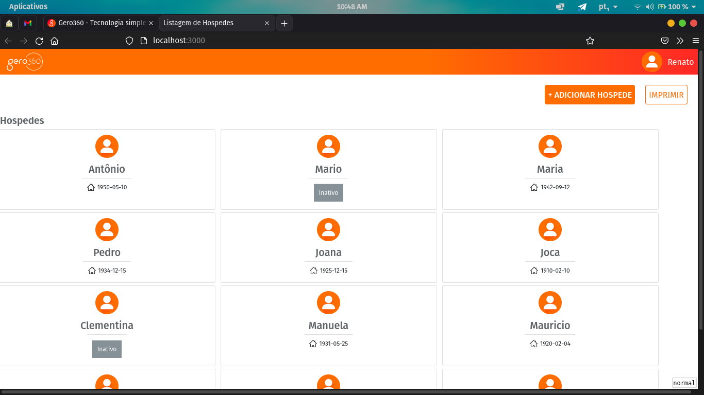
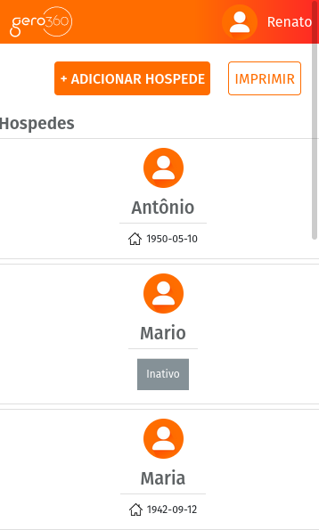

   

# Desafio Gero360

### Desafio HTML-JavaScript:

Site Desktop:

  

Mobile:

  

## Rodando o site:

Clone este repositório:
- ``https://github.com/redmasters/desafio-gero.git ``
- ``cd desafio-gero/html-javascript``
- ``npm install ``
- ``npm run start``
- Acesse: http://localhost:3000

Para executar o SQL:
- ``cd desafio-gero/sql/``
- Siga as instruções que constam no README da pasta.

## 🚀 Tecnologias:
- HTML
- CSS
- EJS
- Express
- JavaScript
- Sqlite
- nodeJS v16.6.2

## 🖌️ Editores:
- VSCode
- Beekeeper-Studio

