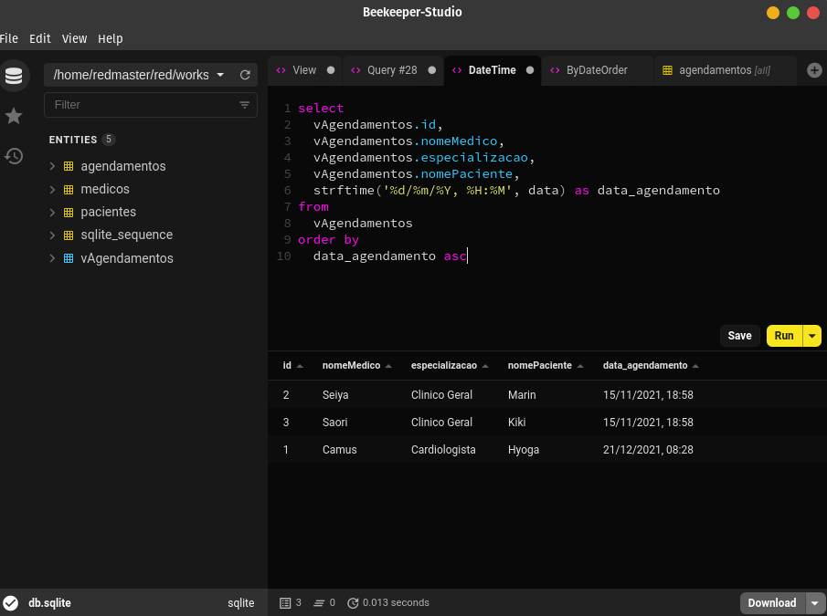
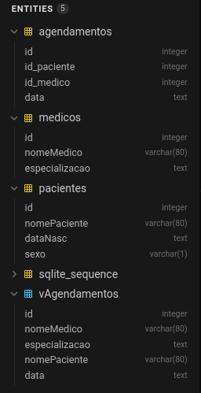
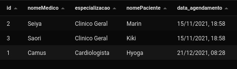

  

# Desafio SQL

  

Implementei o desafio em sqlite, fiz uma configuração básica em JavaScript para gerar o banco de dados assim como suas tabelas. Os comandos ``npm run init-db`` e `` npm run insert-data`` criam o banco de dados com as tabelas abaixo descritas e inserem alguns pacientes e médicos à estas.
Banco de dados: ``db.sqlite``

### Para executar, clone este repositório:
- ``https://github.com/redmasters/desafio-gero.git ``
- ``cd desafio-gero/sql ``
- ``npm install``
- ``npm run init-db`` -- inicia o banco de dados
- ``npm run insert-data`` -- insere pacientes e médicos

## Tabelas: 
- pacientes
- medicos
- agendamentos

## Views
- vAgendamentos

  

---
## Campos:
### pacientes
- id INTEGER PK AUTOINCREMENT;
- nomePaciente VARCHAR(80);
- dataNasc TEXT;
- sexo VARCHAR(1);

### medicos
- id INTEGER PK AUTOINCREMENT;
- nomeMedico VARCHAR(80);
- especializacao TEXT;

### agendamentos
- id INTEGER PK AUTOINCREMENT;
- id_paciente INTEGER;
- id_medico INTEGER;
- data TEXT _--formato: 'YYYY-MM-DD'_;
- FOREIGN KEY (id_paciente) REFERENCES pacientes(id);
- FOREIGN KEY (id_medico) REFERENCES medicos(id);

## VIEWs
### vAgendamentos
Esta view busca nas tabelas os agendamentos, medicos e pacientes seus dados para exibir uma consulta resumida ordenada pelo id do agendamento, nome do médico, especialização, nome do paciente, data e horário do agendamento. A VIEW encontra-se gerada dentro da própria base dados ``db.sqlite``

Para a criação da view:

`` create view vAgendamentos as
select
  agendamentos.id,
  medicos.nomeMedico,
  medicos.especializacao,
  pacientes.nomePaciente,
  agendamentos.data
from
  agendamentos
  inner join medicos on medicos.id = agendamentos.id_medico
  inner join pacientes on pacientes.id = agendamentos.id_paciente
  ``

Para adequar-se ao que foi pedido no desafio a query:

`` 
select
  vAgendamentos.id,
  vAgendamentos.nomeMedico,
  vAgendamentos.especializacao,
  vAgendamentos.nomePaciente,
  strftime('%d/%m/%Y, %H:%M', data) as data_agendamento
from
  vAgendamentos
order by
  data_agendamento asc
``

Esta query já retorna a data e horários formatados.

## INSERT de dados:
### pacientes

``INSERT INTO pacientes VALUES(
    null,
    'Hyoga',
    '15-07-78',
    'M'
)``

``INSERT INTO pacientes VALUES(
    null,
    'Marin',
    '28-10-88',
    'F'
)``

``INSERT INTO pacientes VALUES(
    null,
    'Kiki',
    '02-01-98',
    'M'
)``

### medicos
``INSERT INTO medicos VALUES(
    null,
    'Camus',
    'Cardiologista'
)
``

``INSERT INTO medicos VALUES(
    null,
    'Saori',
    'Clinico Geral'
)
``

``INSERT INTO medicos VALUES(
    null,
    'Seiya',
    'Clinico Geral'
)``

### agendamentos
Para agendar consultas insira o ID do paciente o ID do médico a data e horário no formato 'YYYY-MM-DD HH:MM:SS'

``INSERT INTO agendamentos VALUES (
    null,
    1,
    1,
    '2021-12-21 08:28:28'
)
``

``INSERT INTO agendamentos VALUES (
    null,
    2,
    3,
    '2021-11-15 18:58:18'
)``

``INSERT INTO agendamentos VALUES (
    null,
    3,
    2,
    '2021-11-15 18:58:18'
)``

## Consultando agendamentos
Para consultar agendamentos utilize a seguinte query:

Com a VIEW criada:

`` 
select
  vAgendamentos.id,
  vAgendamentos.nomeMedico,
  vAgendamentos.especializacao,
  vAgendamentos.nomePaciente,
  strftime('%d/%m/%Y, %H:%M', data) as data_agendamento
from
  vAgendamentos
order by
  data_agendamento asc
``

  
  <h5>Resultado da Consulta</h5>

## 💡
No arquivo [tabelas.sql](./tabelas.sql) constam todos os comandos usados para criação das tabelas do banco de dados e da view descritas aqui.

## 🚀 Tecnologias:
- HTML
- CSS
- EJS
- Express
- JavaScript
- Sqlite
- nodeJS v16.6.2

## 🖌️ Editores:
- VSCode
- Beekeeper-Studio

